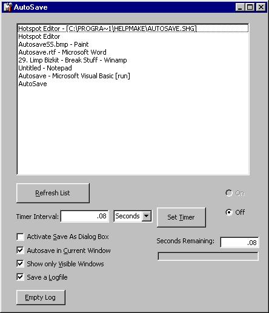



## Autosave v1\.2

### Description

Here is the second edition of the award-winning Autosave program! This time it was programmed in Visual Basic 6 instead of VB5, so the errors that some users encountered with the previous version have been remedied; Version 1.2 works with both VB5 and VB6.

New things in this version include:

Upgraded Interface, System-wide Hotkeys using DX7 DirectInput, a Help File, New Options to save a log, and to display only visible windows, a fixed Timer so that the interval can be more that 65535, an Option to choose Timer Interval in minutes or seconds, and much more.

If you like Autosave, you'll definitely like Autosave v1.2!!

Check it out today, and don't forget to vote for me!
 
### More Info
 
Input from keyboard

             |
---                |---
**Submitted On**   |2000-11-11 23:04:54
**By**             |[Daniel Vandersluis](https://github.com/Planet-Source-Code/PSCIndex/blob/master/ByAuthor/daniel-vandersluis.md)
**Level**          |Advanced
**User Rating**    |4.9 (143 globes from 29 users)
**Compatibility**  |VB 5\.0, VB 6\.0
**Category**       |[Complete Applications](https://github.com/Planet-Source-Code/PSCIndex/blob/master/ByCategory/complete-applications__1-27.md)
**World**          |[Visual Basic](https://github.com/Planet-Source-Code/PSCIndex/blob/master/ByWorld/visual-basic.md)
**Archive File**   |[CODE\_UPLOAD1172211152000\.zip](https://github.com/Planet-Source-Code/daniel-vandersluis-autosave-v1-2__1-12825/archive/master.zip)

### API Declarations

Version 1.2 has even more API calls than its predecessor, but as usual, it is all commented extensively, and easy to follow.

